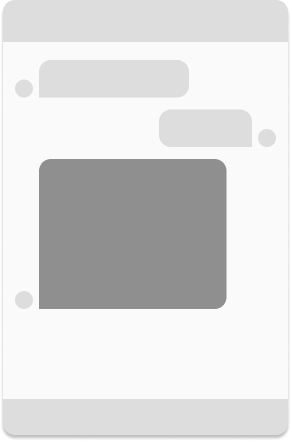
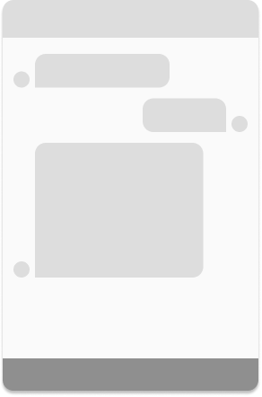
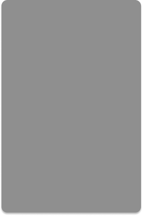
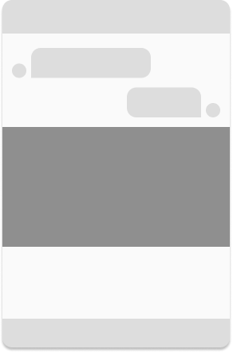
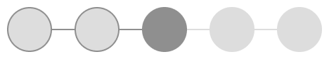
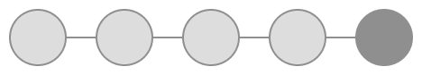

# Cognigy Webchat Plugins
This repository contains example plugins for the [Cognigy Webchat](https://github.com/Cognigy/WebchatWidget).
Additionally, it contains a guide to get you started for plugin development.

## Introduction
This guide will help getting you started building cognigy webchat plugins.
While this page is focused primarily on basic concepts, you may want to jump in and [build a plugin](./docs/get-started.md), see some explanatory [examples](./docs/examples.md) or dive into the [API reference](./docs/api-reference.md).

- [Get Started](https://support.cognigy.com/hc/en-us/articles/360019600619-Get-Started-with-Webchat-Plugins) 
- [Examples](./docs/examples.md)
- [API Reference](./docs/api-reference.md)
- [Releases](https://support.cognigy.com/hc/en-us/articles/360019600399-Webchat-Plugins-Overview)

## Plugin Concepts

### Display Types
#### Inline Message
By default, messages will get rendered `inline`, with an avatar next to it, aligned to the side of the message origin.

  

#### Input
If one needs to provide specific input text fields, the input plugin can be used. With this type, various input features can be implemented -- such as an auto-complete field. 

#### Fullscreen Message
Message plugins can utilize a 'fullscreen' mechanism that will render it fullscreen, filling out all the viewport of the webchat. This can be used to create dialog-like mechanics where the user's attention can be locked onto the next step.

### Fullwidth Message
When displaying content that needs space and is not directly percieved as a message (such as images, event notifications, qr codes), a plugin can be configured to be displayed fullwidth, without an avatar, alignment and padding. 

### Plugins as Middlewares

For every message, the webchat decides how to render it by iterating over all the registered message plugins.
Every plugin contains a mechanism that can decide whether it matches a message or not.
If a plugin matches a message, the webchat will stop iterating and use that plugin to render the message.

In the examples below, we have a total of five webchat plugins.
The webchat iterates through each plugin from left to right until it finds a match.
Outlined circles represent plugins that did not match, dark circles represent matched plugins, light circles represent plugins that were not taken into consideration.

  

If no matching custom plugin was found, the webchat will fall back to its default message plugin (the last one).

  

When a message is matched by a custom plugin that has the 'passthrough' option enabled, the webchat will render the message with that plugin and then continue iterating, making multiple outputs for a single message possible.

