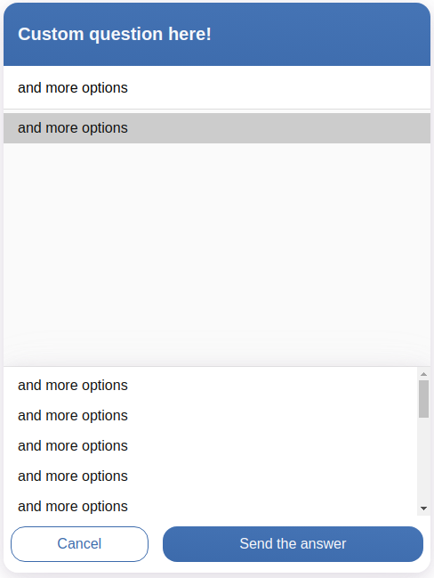

# Releases

Screenshot | Name  | Description  | Download  | Version  |
|--|---|---|---|---|
| <a href="https://github.com/Cognigy/WebchatPlugins/blob/master/plugins/file-upload/docs/file-upload-dialog.png?raw=true"></img></a> | [File Upload](https://github.com/Cognigy/WebchatPlugins/tree/master/plugins/file-upload)  |  Upload user files in the webchat |  [Download](https://github.com/Cognigy/WebchatPlugins/releases/download/fileUpload1.0.0/file-upload.webchat-plugin.js) |  1.0.0 |
| <a href="https://github.com/Cognigy/WebchatPlugins/blob/master/plugins/google-maps/assets/google-maps-Webchat.PNG?raw=true"></img></a>|  [Google Maps](https://github.com/Cognigy/WebchatPlugins/tree/master/plugins/google-maps) | Show a google maps location  | [Download](https://github.com/Cognigy/WebchatPlugins/releases/download/google-maps101/google-maps.webchat-plugin.js)  |  1.0.1 |
| <a href="./plugins/multiselect/docs/multiselect.png"></img></a>|  [Multiselect](https://github.com/Cognigy/WebchatPlugins/tree/master/plugins/multiselect) | Provide multi selections  | [Download](https://github.com/Cognigy/WebchatPlugins/releases/download/multiselect100/multiselect.webchat-plugin.js)  |  1.0.0 |
| <a href="https://camo.githubusercontent.com/bf9606fcd853736f18107304f0f70328c6b8bd25/68747470733a2f2f74656d706275636b65742d7761616e646572732e73332e65752d63656e7472616c2d312e616d617a6f6e6177732e636f6d2f436f676e69677957656263686174506c7567696e732f70726f67726573732e706e67"></img></a> | [Progress Bar](https://github.com/Cognigy/WebchatPlugins/tree/master/plugins/progressbar)  |  Show a progress bar with various steps |  [Download](https://github.com/Cognigy/WebchatPlugins/releases/download/progressbar100/progressbar.webchat-plugin.js) | 1.0.0  |
| <a href="https://github.com/Cognigy/WebchatPlugins/blob/master/plugins/paypal/docs/paypal1.png?raw=true"></img></a> | [PayPal](https://github.com/Cognigy/WebchatPlugins/tree/master/plugins/paypal)  |  Provide PayPal payments |  [Download](https://github.com/Cognigy/WebchatPlugins/releases/download/paypal100/paypal-webchat-plugin.js) | 1.0.0  |
| <a href="https://github.com/Cognigy/WebchatPlugins/blob/master/plugins/push-notification/docs/warning.png?raw=true"></img></a> | [Push Notification](https://github.com/Cognigy/WebchatPlugins/tree/master/plugins/push-notification)  | Send push notifications with the [Cognigy Notify API](https://docs.cognigy.com/reference#notify)  | [Download](https://github.com/Cognigy/WebchatPlugins/releases/download/push-notification100/push-notification-plugin.js)  |  1.0.0 |
| <a href="https://github.com/Cognigy/WebchatPlugins/blob/master/plugins/qr-code-reader/docs/scan.png?raw=true"></img></a> | [QR Code Reader](https://github.com/Cognigy/WebchatPlugins/tree/master/plugins/qr-code-reader) | Let the user scan QR Codes and send the result to Cognigy.AI |  [Download](https://github.com/Cognigy/WebchatPlugins/releases/download/qr-code-reader100/qr-code.webchat-plugin.js) |  1.0.0 |
| <a href="https://github.com/Cognigy/WebchatPlugins/blob/master/plugins/rating/docs/1.png?raw=true"></img></a> | [Rating](https://github.com/Cognigy/WebchatPlugins/tree/master/plugins/rating) |  Provide user ratings in the webchat|  [Download](https://github.com/Cognigy/WebchatPlugins/releases/download/rating110/rating.webchat-plugin.js) |  1.1.0 |
| <a href="https://github.com/Cognigy/WebchatPlugins/blob/master/plugins/signature/assets/signature.jpg?raw=true"></img></a> | [Signature](https://github.com/Cognigy/WebchatPlugins/tree/master/plugins/signature) |  Let your user sign anything in the webchat|  [Download](https://github.com/Cognigy/WebchatPlugins/releases/download/signature100/signature.webchat-plugin.js) |  1.0.0 |