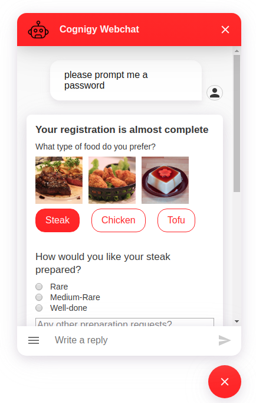

# Cognigy Webchat Adaptive Cards Plugin
This repository contains a Microsoft [Adaptive Cards](https://adaptivecards.io/) plugin for the [Cognigy Webchat](https://github.com/Cognigy/WebchatWidget).
It wraps the [react-adaptivecards](https://github.com/gatewayapps/react-adaptivecards) component for use in the Cognigy Webchat.



## Installation

1. Clone this repo
2. Install all necessary dependencies via `nmp i`
3. Run `npm run build` - this will create a `dist/adaptivecards.webchat-plugin.js` plugin file for you
4. Use that file in your Cognigy Webchat as described in [Get Started](https://github.com/Cognigy/WebchatPlugins/blob/master/docs/get-started.md).

## Calling the Plugin from Cognigy
You can call the plugin from within Cognigy by sending a data message using a Say Node.

```JSON
{
  "_plugin": {
    "type": "adaptivecards",
    "payload": {
      "$schema": "http://adaptivecards.io/schemas/adaptive-card.json",
      "type": "AdaptiveCard",
      "version": "1.0",
      "body": [
        {
          "type": "TextBlock",
          "text": "Your registration is almost complete",
          "size": "medium",
          "weight": "bolder"
        },
        {
          "type": "TextBlock",
          "text": "What type of food do you prefer?",
          "wrap": true
        },
        {
          "type": "ImageSet",
          "imageSize": "medium",
          "images": [
            {
              "type": "Image",
              "url": "http://contososcubademo.azurewebsites.net/assets/steak.jpg"
            },
            {
              "type": "Image",
              "url": "http://contososcubademo.azurewebsites.net/assets/chicken.jpg"
            },
            {
              "type": "Image",
              "url": "http://contososcubademo.azurewebsites.net/assets/tofu.jpg"
            }
          ]
        }
      ],
      "actions": [
        {
          "type": "Action.ShowCard",
          "title": "Steak",
          "card": {
            "type": "AdaptiveCard",
            "body": [
              {
                "type": "TextBlock",
                "text": "How would you like your steak prepared?",
                "size": "medium",
                "wrap": true
              },
              {
                "type": "Input.ChoiceSet",
                "id": "SteakTemp",
                "style": "expanded",
                "choices": [
                  {
                    "title": "Rare",
                    "value": "rare"
                  },
                  {
                    "title": "Medium-Rare",
                    "value": "medium-rare"
                  },
                  {
                    "title": "Well-done",
                    "value": "well-done"
                  }
                ]
              },
              {
                "type": "Input.Text",
                "id": "SteakOther",
                "isMultiline": true,
                "placeholder": "Any other preparation requests?"
              }
            ],
            "actions": [
              {
                "type": "Action.Submit",
                "title": "OK",
                "data": {
                  "FoodChoice": "Steak"
                }
              }
            ]
          }
        },
        {
          "type": "Action.ShowCard",
          "title": "Chicken",
          "card": {
            "type": "AdaptiveCard",
            "body": [
              {
                "type": "TextBlock",
                "text": "Do you have any allergies?",
                "size": "medium",
                "wrap": true
              },
              {
                "type": "Input.ChoiceSet",
                "id": "ChickenAllergy",
                "style": "expanded",
                "isMultiSelect": true,
                "choices": [
                  {
                    "title": "I'm allergic to peanuts",
                    "value": "peanut"
                  }
                ]
              },
              {
                "type": "Input.Text",
                "id": "ChickenOther",
                "isMultiline": true,
                "placeholder": "Any other preparation requests?"
              }
            ],
            "actions": [
              {
                "type": "Action.Submit",
                "title": "OK",
                "data": {
                  "FoodChoice": "Chicken"
                }
              }
            ]
          }
        },
        {
          "type": "Action.ShowCard",
          "title": "Tofu",
          "card": {
            "type": "AdaptiveCard",
            "body": [
              {
                "type": "TextBlock",
                "text": "Would you like it prepared vegan?",
                "size": "medium",
                "wrap": true
              },
              {
                "type": "Input.Toggle",
                "id": "Vegetarian",
                "title": "Please prepare it vegan",
                "valueOn": "vegan",
                "valueOff": "notVegan"
              },
              {
                "type": "Input.Text",
                "id": "VegOther",
                "isMultiline": true,
                "placeholder": "Any other preparation requests?"
              }
            ],
            "actions": [
              {
                "type": "Action.Submit",
                "title": "OK",
                "data": {
                  "FoodChoice": "Vegetarian"
                }
              }
            ]
          }
        }
      ]
    }
  }
}
```
