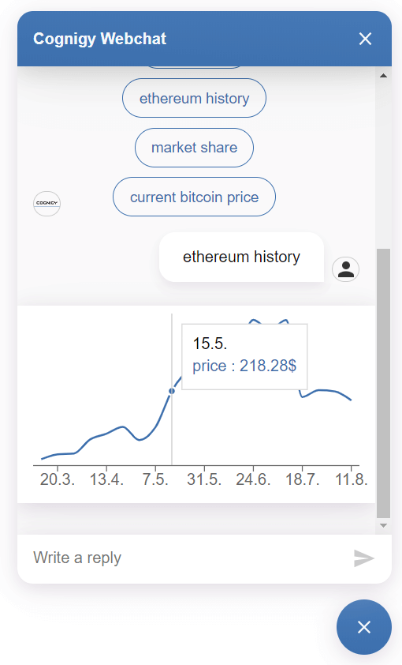
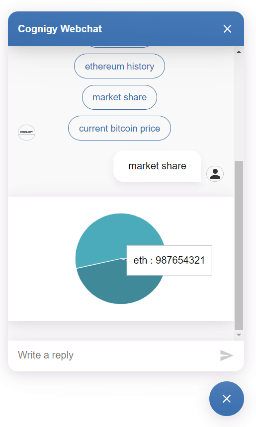

# Chart Plugin
This plugin renders a fullwidth message containing a chart rendered by the [recharts](http://recharts.org) library.
Its goal is to bring chart rendering functionality to the Cognigy Webchat with an API that is close as possible to the one of rechartjs.

## Line Chart 

### Message Data Structure
```typescript
interface LineChartMessageData {
    _plugin: {
        type: 'chart';
        chartType: 'line';

        // http://recharts.org/en-US/api/ComposedChart
        chart: ComposedChartProps;

        // http://recharts.org/en-US/api/Line
        lines: LineProps[];

        // http://recharts.org/en-US/api/XAxis
        xAxis?: XAxisProps;

        // http://recharts.org/en-US/api/YAxis
        yAxis?: YAxisProps;

        // http://recharts.org/en-US/api/Tooltip
        tooltip?: TooltipProps | boolean;
    }
}
```
[LineChart Example Message](./docs/LineChart.message.json)

## Bar Chart

### Message Data Structure
```typescript
interface BarChartMessageData {
    _plugin: {
        type: 'chart';
        chartType: 'line';

        // http://recharts.org/en-US/api/ComposedChart
        chart: ComposedChartProps;

        // http://recharts.org/en-US/api/Bar
        bars: BarProps[];

        // http://recharts.org/en-US/api/XAxis
        xAxis?: XAxisProps;

        // http://recharts.org/en-US/api/YAxis
        yAxis?: YAxisProps;

        // http://recharts.org/en-US/api/Tooltip
        tooltip?: TooltipProps | boolean;
    }
}
```
[BarChart example message](./docs/BarChart.message.json)

## Pie Chart

```typescript

// http://recharts.org/en-US/api/Pie
interface PiePropsWithCells extends PieProps {
     // http://recharts.org/en-US/api/Cell
    cells?: CellProps[];
}

interface PieChartMessageData {
    _plugin: {
        type: 'chart';
        chartType: 'line';

        // http://recharts.org/en-US/api/ComposedChart
        chart: ComposedChartProps;

        pies: PiePropsWithCells[];

        // http://recharts.org/en-US/api/Tooltip
        tooltip?: TooltipProps | boolean;
    }
}
```
[PieChart example message](./docs/PieChart.message.json)

## Single Value

```typescript
interface SingleChartMessageData {
    _plugin: {
        type: 'chart';
        chartType: 'single';

        // the value that should be displayed (will be animated)
        value: number;
        // an optional unit for the single value
        unit?: string;
    }
}
```
[Single Value example message](./docs/Single.message.json)
