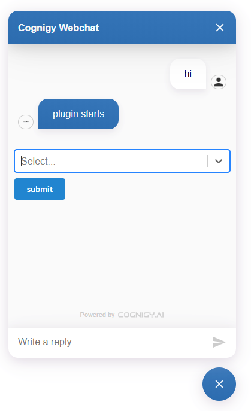

# Dropdown Webchat Plugin

Enable selecting values in the webchat.

## How to use this plugin:

1. You need to copy the plugin's code and run the following commands:
    - `npm i`
    - `npm run build`
2. Now, you should find a folder called `dist` which contains a `dropdown.webchat-plugin.js` file. This file whether needs to be included into your `index.html` file which opens the webchat or uploaded to a cloud storage to add it to the Cognigy Webchat Configuration in the Webchat Endpoint.
3. In your Cognigy.AI project, you need to define a Flow that starts the webchat plugin. Therefore, use the following JSON data as Data informatoin in the SAY Node:

```json
{
  "_plugin": {
    "type": "dropdown",
    "items": [
        {
            "label": "Coca Cola",
            "value": "cola"
        }
    ]
  }
}
```

After the above SAY node was executed by Cognigy.AI, it should show the following content in your webchat:

</img>