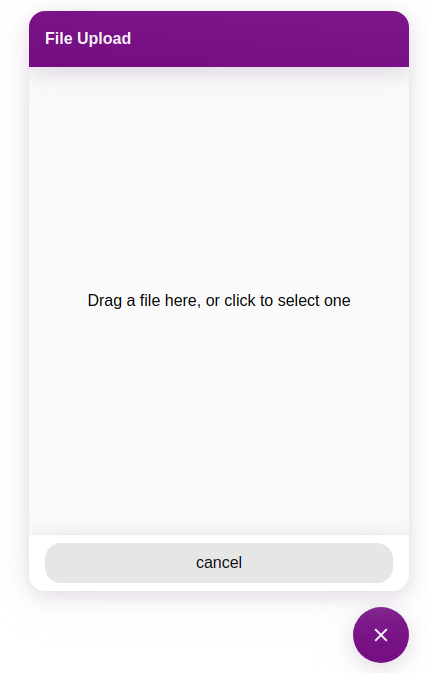

# File Upload Plugin
This Plugin enables bots to request files from users.
The User will see a button to open a file upload dialog.
In the Dialog, the user can then select a file to upload (drag n drop is supported).
The File will be uploaded to a predefined destination of a third-party service (e.g. Amazon S3).




## Using the Custom Module
To trigger the file-upload plugin in the Webchat, you need to send a specifically formated message from Cognigy. 
We do provide Flow Nodes for triggering an upload dialog via a [Custom Module](https://github.com/Cognigy/CustomModules/tree/master/modules/file-upload-plugin). Using this, you can automatically generate and send the messages needed by the Webchat Plugin. 

## Result Message
After uploading, the plugin will send a hidden message to the bot with an URL to the file in `ci.data.file`.
```typescript
{
  data: {
    file: 'https://example.com/url-to-file'
  }
}
```


## Upload to Amazon S3
Allows users to upload a file to an Amazon S3 Bucket using a [Presigned URL](https://docs.aws.amazon.com/AmazonS3/latest/dev/PresignedUrlUploadObject.html).
The Plugin will need a presigned `uploadUrl` for uploading the file, as well as a presigned `downloadUrl` to get read access to the file after uploading.


### Message Data Structure
```typescript
interface UploadToS3BucketData {
  _plugin: {
        type: 'file-upload';
        service: 'amazon-s3';

        // presigned upload url
        uploadUrl: string;
        
        // presigned download url
        downloadUrl: string;
    }
}
```
[Upload to Amazon S3 Example Message](./docs/AmazonS3.message.json)


## Upload to Microsoft Azure Storage
Allows users to upload a file to an Azure Storage Containers using a [Shared acces Signature](https://docs.microsoft.com/es-es/rest/api/storageservices/delegate-access-with-shared-access-signature)   
The Plugin will need a presigned `sasSignature`, a `baseUrl` and the `containerName` to create a URL for uploading the file, the same URL can be use to download the file after uploading it, if the timeout property from the Custom Module didn't make the URL invalid.


### Message Data Structure
```typescript
interface UploadToAzureContainer {
   _plugin: {
       type: 'file-upload',
       service: 'azure',
       
       // Base url to build the request 
       baseURL,
       
       // Shared Access Signature token
       sasSignature,
       
       // Name of the container where the file will be uploaded
       containerName,
   }
}


