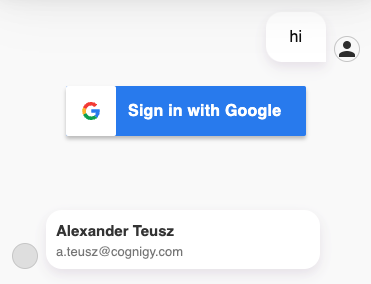

# Cognigy Webchat Google Firebase Authentication Plugin
This repository contains a google firebase authentication plugin for the [Cognigy Webchat](https://github.com/Cognigy/WebchatWidget).



## Installation

1. Clone this repo
2. Install all necessary dependencies via `nmp i`
3. Run `npm run build` - this will create a `dist/google-firebase-authentication.webchat-plugin` plugin file for you
4. Use that file in your Cognigy Webchat as described in the [Cognigy Docs](https://docs.cognigy.com/docs/using-additional-webchat-plugins).

## Calling the Plugin from Cognigy
You can call the plugin from within Cognigy by sending a data message using a Say Node.
You can specify following optional parameters:

```json
{
{
    "_plugin": {
        "type": "google-firebase-authentication",
        "firebase": {
            "apiKey": "...",
            "authDomain": "test.firebaseapp.com",
            "projectId": "test",
            "storageBucket": "test.appspot.com",
            "messagingSenderId": "123",
            "appId": "1:123:web:3456"
        }
    }
}
}
```

After a successful login from the user, the Webchat Plugin sends back the information about the authenticated user to Cognigy.AI:

```json
{
    "token": "123123",
    "user": {
      "uid": "123",
      "email": "test@mail.com",
      "emailVerified": true,
      "displayName": "Laura Wilson",
      "isAnonymous": false,
      "photoURL": "https://lh3.googleusercontent.com/a/123123",
      "providerData": [
        {
          "providerId": "google.com",
          "uid": "12123",
          "displayName": "Laura Wilson",
          "email": "test@mail.com",
          "phoneNumber": null,
          "photoURL": "https://lh3.googleusercontent.com/a/..."
        }
      ],
      "stsTokenManager": {
        "refreshToken": "...",
        "accessToken": "...",
        "expirationTime": 123123123
      },
      "createdAt": "123123",
      "lastLoginAt": "123123",
      "apiKey": "...",
      "appName": "[DEFAULT]"
    }
  },
```