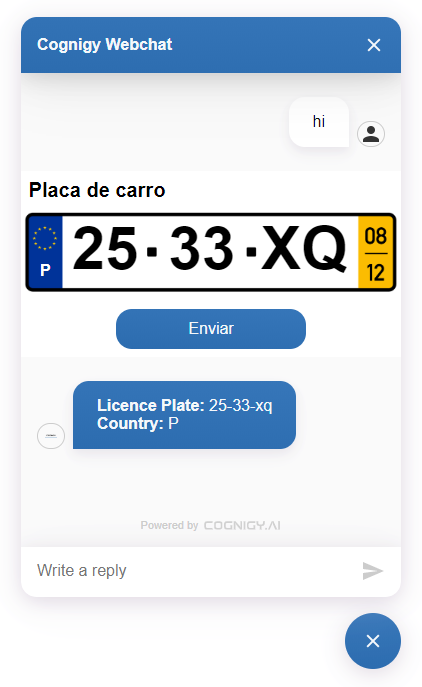

# Licence Plate

With this webchat plugin a user can insert his licence plate to send this information to the AI.

## How to use

``` js
actions.output('', {
  "_plugin": {
    "type": "licence-plate",
    "countryCode": "P",
    "label": "Placa de carro",
    "buttonText": "Enviar"
  }
});
```

It will show the following plugin in the webchat



After inserting the empty text field, such as shown in the image above, the user can click on the send button ("Enviar" (Spanish)).

