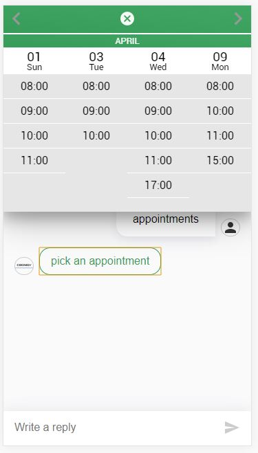
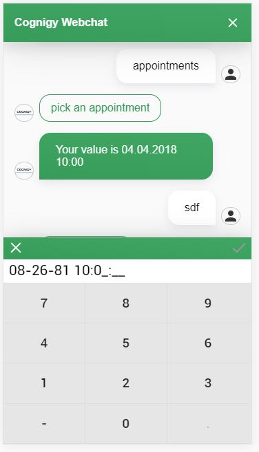

# Cognigy Webchat Number Pad Plugin
This repository contains a number pad plugin for the [Cognigy Webchat](https://github.com/Cognigy/WebchatWidget).
It wraps the [React NumPad](https://www.npmjs.com/package/react-numpad) component for use in the Cognigy Webchat.




## Installation

1. Clone this repo
2. Install all necessary dependencies via `nmp i`
3. Run `npm run build` - this will create a `dist/numpad.webchat-plugin.js` plugin file for you
4. Use that file in your Cognigy Webchat as described in the [Cognigy Docs](https://docs.cognigy.com/docs/using-additional-webchat-plugins).

## Calling the Plugin from Cognigy
You can call the plugin from within Cognigy by sending a data message using a Say Node.

```
{
  "_plugin": {
    "type": "numpad",
    "buttonText": "click here"
  }
}
```

Upon confirming a numpad entry, the value will be returned to Cognigy as a data only message. You can the value via `ci.data.value`

### Numpad Types
The NumPad comes in four different types with their own properties:

- Number (default)
- DateTime
- Calendar
- Appointments

#### Number
This numpad display numbers from 0 - 9, plus decimal markers and a minus for negative numbers. You can specify following optional parameters:

```
{
  "_plugin": {
    "type": "numpad",
    "numpadType": "number",
    "position": "center",
    "buttonText": "pick a number",
    "decimal": 5,
    "negative": false,
  }
}
```

#### Datetime
This numpad opens a date and time picker. You can specify following optional parameters:

```
{
  "_plugin": {
    "type": "numpad",
    "numpadType": "dateTime",
    "position": "flex-end",
    "buttonText": "Choose date & time",
    "dateFormat": "MM-DD-YY HH:mm:ss",
  }
}
```

#### Calendar
This numpad opens a calendar to choose a date from. You can specify following optional parameters:

```
{
  "_plugin": {
    "type": "numpad",
    "numpadType": "calendar",
    "position": "flex-start",
    "buttonText": "Choose from calendar",
    "min": "20.08.1981",
    "max": "30.08.1981",
    "value": "25.08.1981",
    "markers": [
      "26.08.1981"
    ],
    "locale": "de"
  }
}
```

#### Appointments
This numpad shows a table of available appointments to choose from. You can specify following optional parameters:

```
{
  "_plugin": {
    "type": "numpad",
    "position": "flex-start",
    "numpadType": "appointments",
    "buttonText": "pick an appointment",
    "dates": {
      "01.04.2018": [
        "08:00",
        "09:00",
        "10:00",
        "11:00"
      ],
      "03.04.2018": [
        "08:00",
        "09:00",
        "10:00"
      ],
      "04.04.2018": [
        "08:00",
        "09:00",
        "10:00",
        "11:00",
        "17:00"
      ],
      "09.04.2018": [
        "08:00",
        "10:00",
        "11:00",
        "15:00"
      ]
    }
  }
}
```
