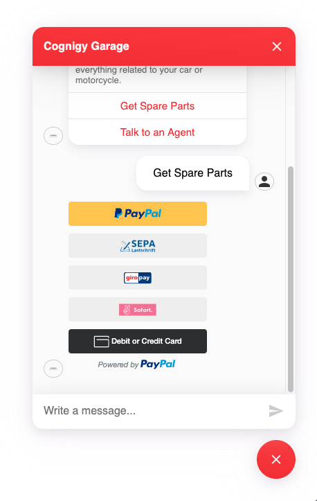
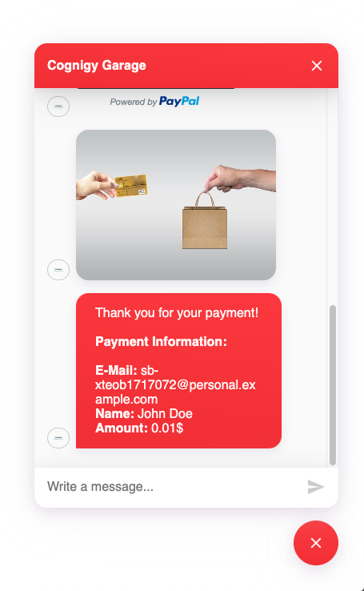

# PayPal Webchat Plugin

Provide payments with PayPal services in your webchat. 

## Create a PayPal Developer Account

In order to use this Webchat Plugin, you have to create a developer account: 
https://developer.paypal.com/classic-home/

## How to use the plugin

You can either use a [Say](https://docs.cognigy.com/docs/say-nodes) or [Code](https://docs.cognigy.com/docs/code) node to trigger this webchat plugin. The following example shows a Code node, while you could use the second parameter (object) as `data` information in a Say node. 

``` js
actions.output('', {
	"_plugin": {
		"type": "paypal",
		"amount": 0.01, // The amount the user has to pay
		"clientId": "<INSERT-YOUR-PAYPAL-DEVELOPER-CLIENT-ID>"
	}
})
```

This will open the following example:



As soon as the user clicks on the favorite payment method, a login screen opens to finish the **PayPal Checkout**. Afterward, three different events can be sent to the Cognigy backend: 

1. `success`
	- The payment was successful
2. `cancel`
	- The user aborted the payment
3. `error`
	- There was an error during the payment session

The following image shows an example reaction to the `success` event:

