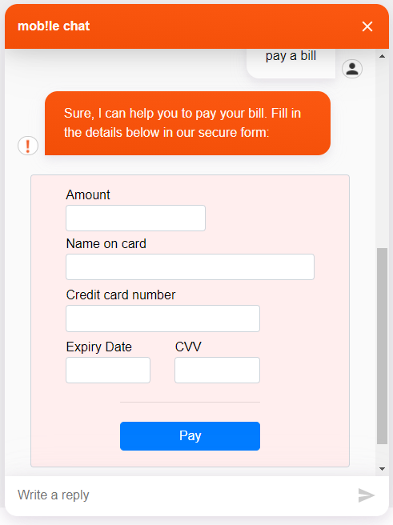

# Payshield Webchat Plugin

Enable payments in chat, via Payshield's secure 'hosted fields' approach.

Essentially, the fields which would trigger PCI-DSS scope, are instead handled by small iFrames to Payshield's secure site,
thereby keeping the local website out of PCI-DSS scope.

## How to use this plugin:

1. You need to copy the plugin's code and run the following commands:
    - `npm i`
    - `npm run build`
2. Now, you should find a folder called `dist` which contains a `payshield.webchat-plugin.js` file. This file needs to be included into your `index.html` file which opens the webchat or uploaded to a cloud storage to add it to the Cognigy Webchat Configuration in the Webchat Endpoint.

3. In your Cognigy.AI project, to trigger the Plugin to display, you must include a Say Node with a data packet formatted as shown below. The scriptUrl and paymentConfiguration values will be provided by Payshield for your solution:

```json
{
  "_plugin": {
    "type": "payshield",
    "scriptUrl": "https://5b1c5322f.i.payshield.com.au/hf/1/hosted.js",
    "paymentConfigurationID": "128813bf-8c8d-4779-a1c6-5ed165cf9910"
  }
}
```

After the above SAY node was executed by Cognigy.AI, it should show the following content in your webchat:

</img>