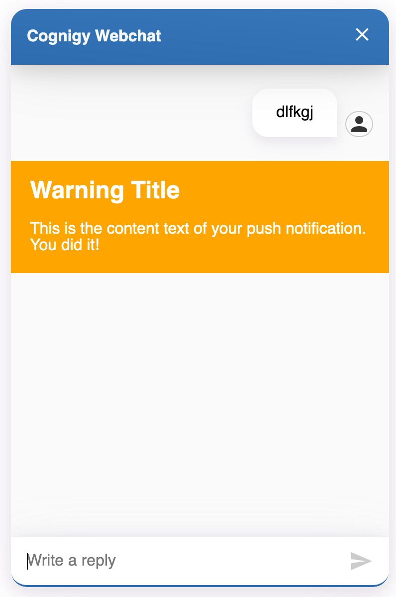
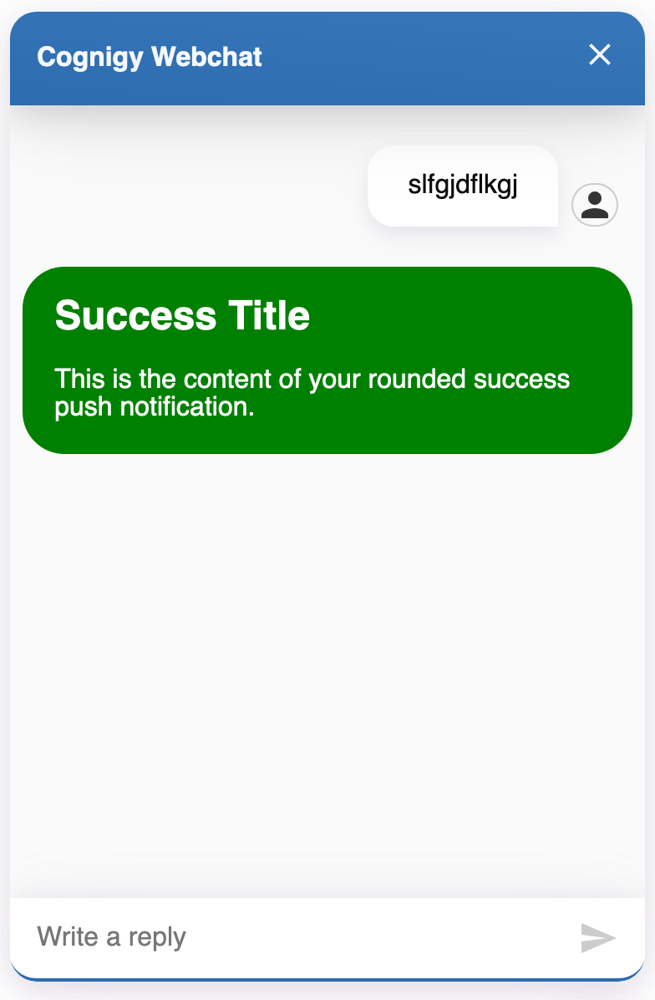

# Push Notification Webchat Plugin

With this Webchat Plugin you can send custom push notifications to your current ongoing webchat session.

To execute the webchat plugin in your conversation, whether use a **Say** Node in Cognigy.AI or the **Code** Node, such as in the following example:
```javascript
actions.output('This is the content text of your push notification. You did it!', {
  "_plugin": {
    "type": "push-notification",
    "title": "Success Title",
    "round": false,
    "variant": "warning"
  }
})
```

The result will look like the following:

</img>

You can also change the `variant` to *success* and set `round` to `true`:

</img>

## Execute the Push Notification with the API

To automatically execute this webchat plugin, you can use the [Cognigy Notify API](https://docs.cognigy.com/reference#notify). There you can use the `text` and `data` parameters to build the example code from the upper example.
