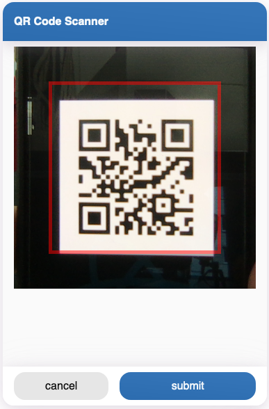
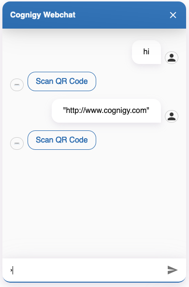

# QR Code Reader

With this webchat plugin, you can read QR codes and send the scanned information back to the chatbot.
In order to do so, you have to send a specifiy **SAY NODE** in Cognigy.AI which starts the plugin in your webchat:
```javascript
actions.output('', {
    _plugin: {
        type: 'qr-code',
        buttonText: "Scn QR Code",
        title: "QR Code Scanner",
        cancelButtonText: "cancel",
        submitButtonText: "submit"
    }
})
```

This configuration will open the plugin, which could look like the following:


After clicking the button **Scan QR Code**, the scanner opens:



Now you can scan the code and click the submit button to send the information back to Cognigy:



## Important Notes:

### IOS

On IOS devices, the webchat has to be deployed via HTTPS to open the iPhone camera. Otherwise, clicking the button won't do anything.

### Webcam

If you want to scan the QR Code on your computer, the webcam has to be open and visible.