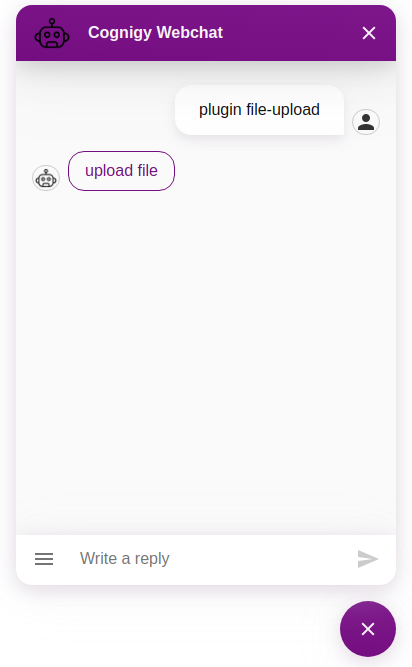

# Datei-Upload-Plugin

Dieses Plugin ermöglicht es Bots, Dateien von Benutzern anzufordern.
Dem Benutzer wird eine Schaltfläche zum Öffnen eines Datei-Upload-Dialogfelds angezeigt.
Im Dialog kann der Benutzer dann eine Datei zum Hochladen auswählen (Drag & Drop wird unterstützt).

Die Datei wird auf SecureHub-File-Upload hochgeladen




## Verwenden des Custom Extensions
Um das Datei-Upload-Plugin im Webchat auszulösen, müssen Sie eine speziell formatierte Nachricht von Cognigy senden.
Wir stellen Flow-Notes zum Auslösen eines Upload-Dialogs über eine benutzerdefinierte Erweiterung bereit. Damit können Sie die vom Webchat-Plugin benötigten Nachrichten automatisch generieren und versenden sowie ein Bearer-Token für den Prozess erstellen.

## ResultMeldung
Nach dem Hochladen sendet das Plugin eine versteckte Nachricht mit einer URL zur Datei in „ci.data.file“ an den Bot.
```typescript
{
   data: {
     file: "https://example.com/url-to-securehub-download-page",
     downloadUrl: "https://example.com/url-to-direct-zip-download",
     _plugin: {
       type: "securehub-file-uploaded",
       name: "Name der Upload-Datei"
   }
   }
}
```

### Nachrichtendatenstruktur im Say-Node

```json
{
   "_plugin": {
     "Typ": "securehub-file-upload",
     "baseURL": "securehub.example.com",
     "folderName": "Name-des-Ordners",
     "bearerToken": "Bear-Token-From-Authorization-API",
     "rejectCertificate": false,
     "defineLinkExpiration": true,
     "linkExpirationDate": "Date-of-Link-Expiration-In-Format-2024-01-15T11:54:34Z"
   }
}
```
Der Linkablauf ist nur erforderlich, wenn Sie ihn selber festlegen möchten.