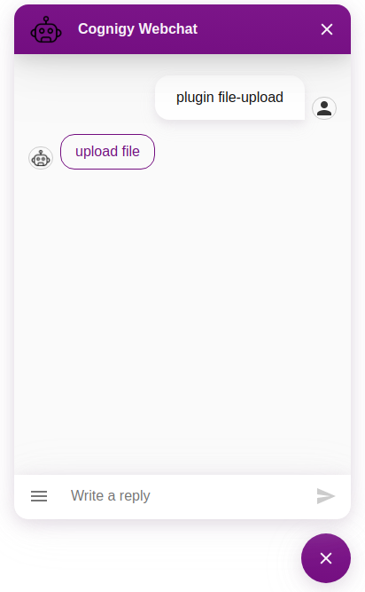
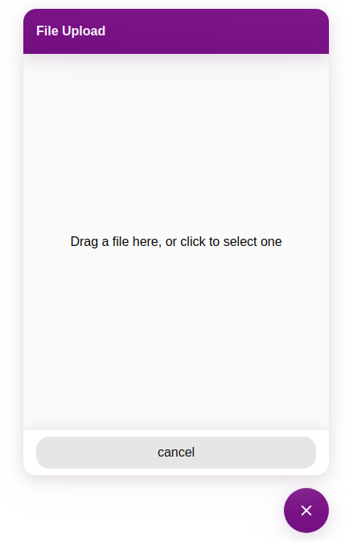

# File Upload Plugin
This Plugin enables bots to request files from users.
The User will see a button to open a file upload dialog.
In the Dialog, the user can then select a file to upload (drag n drop is supported).

The file will be uploaded to SecureHub-File-Upload




## Using the Custom Module
To trigger the file-upload plugin in the Webchat, you need to send a specifically formated message from Cognigy. 
We do provide Flow Nodes for triggering an upload dialog via a Custom Extension. Using this, you can automatically generate and send the messages needed by the Webchat Plugin as well as create a bearer token for the process.

## Result Message
After uploading, the plugin will send a hidden message to the bot with an URL to the file in `ci.data.file`.
```typescript
{
  data: {
    file: 'https://example.com/url-to-securehub-download-page',
    downloadUrl: 'https://example.com/url-to-direct-zip-download',
    _plugin: {
      type: "securehub-file-uploaded",
      name: "Name of upload file"
  }
  }
}
```

### Message Data Structure in Say Node

```json
{
  "_plugin": {
    "type": "securehub-file-upload",
    "baseURL": "securehub.example.com",
    "folderName": "Name-Of-Folder",
    "bearerToken": "Bear-Token-From-Authorization-API",
    "rejectCertificate": false,
    "defineLinkExpiration": true,
    "linkExpirationDate": "Date-of-Link-Expiration-In-Format-2024-01-15T11:54:34Z"
  }
}
```

Link expiration is only necessary if you wish to define it.