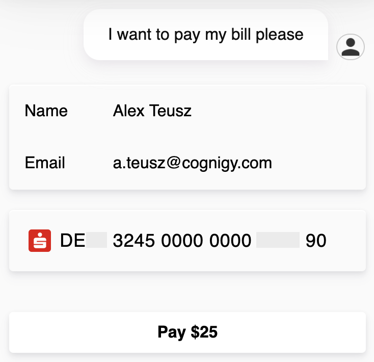

# Stripe Payments Webchat Plugin

With this Webchat Plugin one can provide online payments with [Stripe](https://www.stripe.com).

To execute the webchat plugin in a conversation, whether use a **Say** Node in Cognigy.AI or the **Code** Node, such as in the following example:

```json
{
  "_plugin": {
    "type": "stripe",
    "option": "credit",
    "processButtonText": "Processing...",
    "submitButtonText": "Pay",
    "stripePK": "pk_test_6pRNASCoBOKtIshFeQd4XMUh"
  }
}
```

**Options:**

- Credit Card
  - `"option": "credit"`
- IBAN
  - `"option": "iban"`


After the above SAY node was executed by Cognigy.AI, it should show one of the following contents in your webchat:

**Credit Card:**

</img>

**IBAN:**

</img>


## Result

The plugin will return a data message in order to notify Cognigy.AI about the result:

**Success:**

```json
{
  "stripeResult": "success"
}
```

**Error:**

```json
{
  "stripeResult": "error"
}
```

Now one could use a Lookup node and check the response:

</img>
