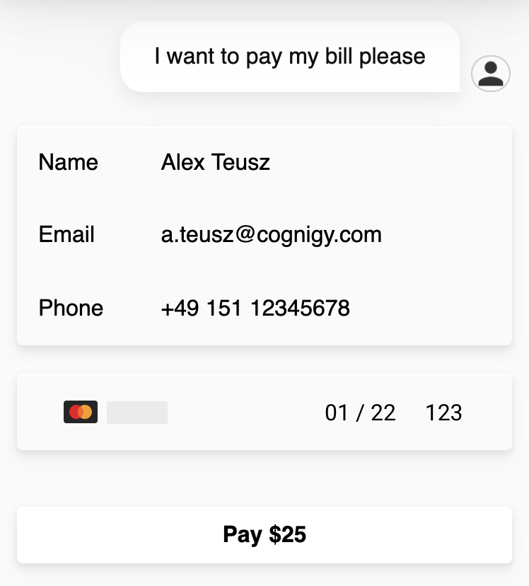

# Push Notification Webchat Plugin

With this Webchat Plugin you can send custom push notifications to your current ongoing webchat session.

To execute the webchat plugin in your conversation, whether use a **Say** Node in Cognigy.AI or the **Code** Node, such as in the following example:

```json
{
  "_plugin": {
    "type": "stripe",
    "successMessage": "Thanks for the payment.",
    "submitButtonText": "Bezahlen",
    "errorMessage": "The payment failed.",
    "stripePK": "pk_test_6pRNASCoBOKtIshFeQd4XMUh"
  }
}
```

After the above SAY node was executed by Cognigy.AI, it should show one of the following contents in your webchat:

</img>