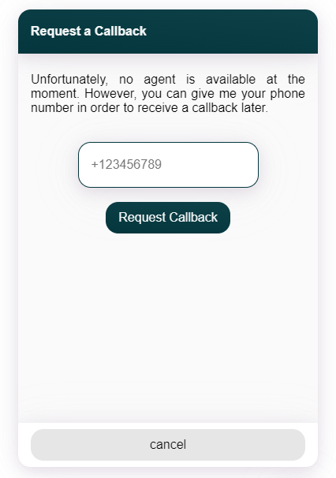

# Zendesk Talk

This Webchat Plugin enables the chat user to request a callback from a Zendesk agent. In oder to do so, only the user's phone number must be provided in the text field.

- [Zendesk Talk API Documentation](https://developer.zendesk.com/api-reference/voice/talk-api/callback_requests/)

To execute the plugin in a conversation, whether use a **Say** Node in Cognigy.AI or the **Code** Node, such as in the following example:

```json
{
    "_plugin": {
        "type": "zendesk-talk",
        "headerTitle": "Request a Callback",
        "submitButtonTitle": "Request Callback",
        "cancelButtonTitle": "cancel",
        "text": "Unfortunately, ...",
        "zendesk": {
            "phoneNumerId": "...",
            "auth": {
                "username": "...",
                "password": "...",
                "subdomain": "..."
            }
        }
    }
}
```

## Example

</img>