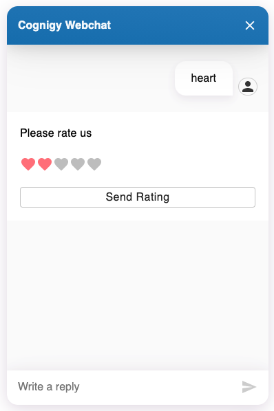

# Rating Webchat Plugin

Enable user ratings in your webchat conversation.

## How to use this plugin:

1. You need to copy the plugin's code and run the following commands:
    - `npm i`
    - `npm run build`
2. Now, you should find a folder called `dist` which contains a `rating.webchat-plugin.js` file. This file whether needs to be included into your `index.html` file which opens the webchat or uploaded to a cloud storage to add it to the Cognigy Webchat Configuration in the Webchat Endpoint.
3. In your Cognigy.AI agent, you need to define a Flow that starts the webchat plugin. Therefore, use the following JSON data as Data informatoin in the SAY Node:

**Configuration:**

- `title`
  - The Title of the rating window
- `initialRating`
  - The default selection
- `size`
  - The size of the icons
  - Options:
    - 'small'
    - 'medium'
    - 'large'
- `variant`
  - What type of icons should be used
  - Options
    - 'star'
    - 'heart'
    - 'emoji'
- `maxRatingValue`
  - How many 'stars' could be selected
- `precision`
  - How precise the selection should be
  - Options:
    - 1
    - 0.5
      - Means that one could select 3.5 'stars'
- `rateButtonText`
  - The text of the submit buttoin
- `label`
  - optional
  - The label of the message bubble sent from the user to Cognigy.AI
- `payload`
  - optional
  - The payload of the user message that will be attached to the selected value
    - e.g. 'Stars' -> "5 Stars"

```json
{
  "_plugin": {
    "type": "rating",
    "title": "Please rate us",
    "initialRating": 2,
    "size": "medium",
    "variant": "star",
    "maxRatingValue": 5,
    "precision": 1,
    "rateButtonText": "Send Rating",
    "label": "I rated you",
    "payload": "Stars"
  }
}
```

After the above SAY node was executed by Cognigy.AI, it should show one of the following contents in your webchat:

</img>

</img>

</img>