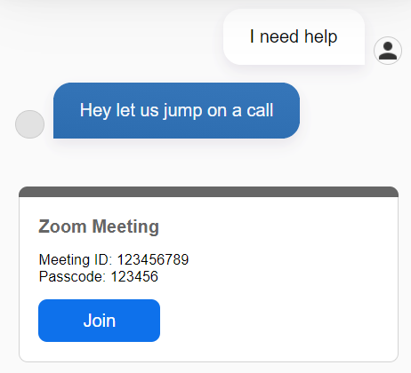

# Zoom Webchat Plugin

Invite a user to a Zoom meeting in your webchat conversation.

## How to use this plugin:

1. You need to copy the plugin's code and run the following commands:
    - `npm i`
    - `npm run build`
2. Now, you should find a folder called `dist` which contains a `zoom.webchat-plugin.js` file. This file whether needs to be included into your `index.html` file which opens the webchat or uploaded to a cloud storage to add it to the Cognigy Webchat Configuration in the Webchat Endpoint.
3. In your Cognigy.AI agent, you need to define a Flow that starts the webchat plugin. Therefore, use the following JSON data as Data informatoin in the SAY Node:

**Configuration:**

- `meetingId`
  - The personal meeting ID
- `meetingLink`
  - The personal meeting link
- `passcode`
  - The passcode in order to enter the meeting
- `title`
  - The title of the plugin message that is diplayed in the webchat
- `joinButtonText`
  - The text of the button that needs to be clicked in order to join the meeting

```json
{
    "_plugin": {
        "type": "zoom",
        "meetingId": "123456789",
        "meetingLink": "https://us02web.zoom.us/j/...",
        "passcode": "123456",
        "title": "Zoom Meeting",
        "joinButtonText": "Join Meeting"
    }
}
}
```

After the above SAY node was executed by Cognigy.AI, it should show one of the following contents in your webchat:

